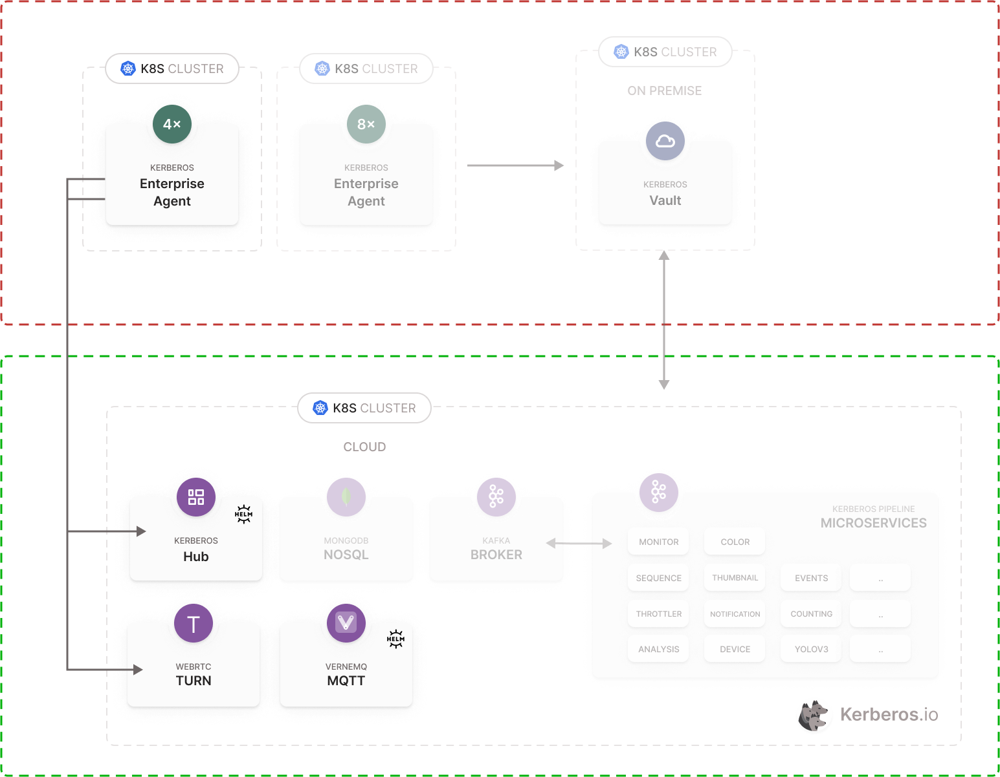

# TURN and STUN

This project is based on the [Pion Turn project](https://github.com/pion/turn), which is an API to create a custom TURN/STUN server and allows you to add authentication, middleware, logging, etc features. 

We are using a TURN and STUN server in our Kerberos Enterprise Suite offering to connect Kerberos Agents, living at the edge, to a remote Kerberos Hub. Livestreams are being forwarded (without port-forwarding enabled) from the edge to the cloud using WebRTC, and therefore relevant services such as TURN and STUN are leveraged.

# Dockerized

Within Kerberos.io we are containerizing everything, so we can simplify our release management, deployments and scalability. We took the opportunity to create a Docker container that runs the [Pion Turn project](https://github.com/pion/turn) and make it configurable through environment variables. This helps us to deploy a TURN/STUN server more easily in different types of environments. 

# How to run

You can build this container yourself by or download it from our Docker registry @ gitlab.

    docker build -t turn-and-sturn .

Or to pull from our registry; you will need to obtain some registry credentials from the Kerberos.io team.

    docker login https://registry.gitlab.com
    docker pull kerberos/turn-stun:1.0.2727592447

When the image is properly build or pulled, you can run the container as following. What is key here is the `--network host` option, this is required to allow the allocation of TURN ports on the host machine. These ports are needed to proxy traffic from the Kerberos Agent to a Kerberos Hub viewer. 

By using the environment option `-e KERBEROS..` you can specify the public IP of the host machine, the credentials and TURN/STUN port.

    docker run -e KERBEROS_TURN_PUBLIC_IP="64.225.70.217" \ 
    -e KERBEROS_TURN_USERS="username1=password1" \ 
    -e KERBEROS_TURN_PORT="8443" \ 
    -e KERBEROS_TURN_REALM="kerberos.io" \ 
    -d --restart always \ 
    --network host kerberos/turn-stun:1.0.2727592447

## TODO

Some open tasks to be taken care of.

- [x] Add UDP example in existing code.
 
- [x] Make credentials, public ip, port configurable through environment variables
 
- [ ] This projects works by enabling `HOST_NETWORK` on the container creation with Docker, but it doesn't work properly when scheduled in a Kubernetes cluster. 
